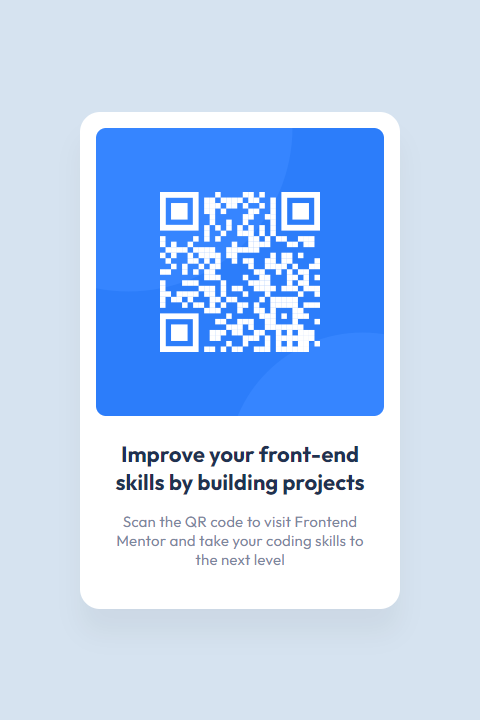

# Frontend Mentor - QR code component solution

This is a solution to the [QR code component challenge on Frontend Mentor](https://www.frontendmentor.io/challenges/qr-code-component-iux_sIO_H).

## Table of contents

- [Overview](#overview)
  - [Screenshot](#screenshot)
  - [Links](#links)
- [My process](#my-process)
  - [Built with](#built-with)
  - [What I learned](#what-i-learned)
  - [Useful resources](#useful-resources)
- [Author](#author)

## Overview

### Screenshot



### Links

- Solution URL: [https://github.com/ferfalcon/qr-code-component-main](https://github.com/ferfalcon/qr-code-component-main/)
- Live Site URL: [https://ferfalcon.github.io/qr-code-component-main](https://ferfalcon.github.io/qr-code-component-main/)

## My process

### Built with

- Semantic HTML5 markup
- CSS custom properties
- CSS Grid
- Mobile-first workflow
- [Less](https://lesscss.org/) - CSS preprocessor for styles
- [BEM](https://nextjs.org/) - Naming convention for HTML elements classification

### What I learned

I started using css custom properties to define every part of the typographic elements to make them more modular:

```css
:root {
	// TYPOGRAPHY
	// Family
	--ff-main: 'Outfit', sans-serif;

	// Size
	--fs-400: .938rem;
	--fs-800: 1.375rem;

	// Weight
	--fw-regular: 400;
	--fw-bold: 700;

	// Element
	--ty-heading: var(--fw-bold) var(--fs-800) var(--ff-main);
	--ty-body: var(--fw-regular) var(--fs-400) var(--ff-main);
}
```

### Useful resources

- [Viewport units](https://www.youtube.com/watch?v=ru3U8MHbFFI)
- [Color palettes](https://www.example.com) - This help me to name colors

## Author

- LinkedIn - [Fernando Falcon](https://www.linkedin.com/in/fernandofalcon/)
- Frontend Mentor - [@ferfalcon](https://www.frontendmentor.io/profile/ferfalcon/)
- Website - [ferfalcon.com](http://ferfalcon.com/)
- Twitter - [@fernandofalcon](https://www.twitter.com/fernandofalcon/)